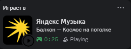

# Yandex Music Discord RPC

<div align="center">


**Интеграция Яндекс.Музыки с Discord Rich Presence**

Показывайте друзьям в Discord, что вы слушаете в Яндекс.Музыке!



</div>

---

## ВАЖНО, ВНИМАНИЕ!!!

Для корректной работы отключите в клиенте Яндекс.Музыка опцию "Плавные переходы между треками"

## Описание

Yandex Music Discord RPC — это легковесное приложение, которое автоматически отображает информацию о текущем треке из Яндекс.Музыки в вашем профиле Discord через Rich Presence.

### Возможности

- **Автоматическое обновление** — отслеживание текущего трека в реальном времени
- **Статус воспроизведения** — отображение состояния (играет/пауза)
- **Минимальное потребление ресурсов** — работает в фоновом режиме
- **Windows Media Session API** — нативная интеграция с системой

### Что отображается

- Название трека
- Исполнитель
- Альбом
- Статус воспроизведения (Playing/Paused)
- Текущее время/Длина трека

---

## Быстрый старт

### Требования

#### Для запуска

- **ОС:** Windows 10/11
- **Discord:** установленный клиент Discord
- **Яндекс.Музыка:** десктопное приложение

#### Для сборки

- **Компилятор:** MSVC (Visual Studio 2019 или новее)
- **CMake:** версия 3.10 или выше

## Использование

1. Скачайте последний релиз из https://github.com/bezdarnosti-yt/yandex_music_discord_presence/releases
2. Запустите Discord
3. Откройте Яндекс.Музыку
4. Запустите `yandex-music-discord-rpc.exe`
5. Включите музыку в Яндекс.Музыке
6. Ваш статус в Discord автоматически обновится!

### Сборка

1. **Клонируйте репозиторий:**
```bash
git clone https://github.com/yourusername/yandex-music-discord-rpc.git
cd yandex-music-discord-rpc
```

2. **Создайте директорию для сборки:**
```bash
mkdir build
cd build
```

3. **Сгенерируйте проект с помощью CMake:**
```bash
cmake ..
```

4. **Скомпилируйте проект:**
```bash
cmake --build . --config Release
```

5. **Запустите приложение:**
```bash
.\Release\yandex-music-discord-rpc.exe
```

---


---

## Технические детали

### Архитектура

Проект использует:
- **Discord Game SDK** — для интеграции с Discord Rich Presence
- **Windows Media Session API** — для получения информации о воспроизводимом треке
- **WinRT C++** — для работы с современными Windows API

### Как это работает

1. Приложение инициализирует Discord SDK
2. Каждые 2 секунды опрашивает Windows Media Session API
3. Проверяет, запущена ли Яндекс.Музыка
4. Получает информацию о текущем треке
5. Обновляет Rich Presence в Discord

---

## Разработка

### Сборка в Debug режиме

```bash
cmake --build . --config Debug
```

### Требуемые зависимости

Все зависимости включены в репозиторий:
- Discord Game SDK (v3.2.1)
- Windows SDK (для WinRT)

---

## Лицензия

Этот проект распространяется под лицензией MIT. См. файл [LICENCE.txt](LICENCE.txt) для подробностей.

---

## Вклад в проект

Вклад в проект приветствуется! Если у вас есть идеи или вы нашли баг:

1. Создайте Fork репозитория
2. Создайте ветку для вашей функции (`git checkout -b feature/AmazingFeature`)
3. Закоммитьте изменения (`git commit -m 'Add some AmazingFeature'`)
4. Запушьте в ветку (`git push origin feature/AmazingFeature`)
5. Откройте Pull Request

---

## Контакты

Если у вас есть вопросы или предложения, создайте Issue в репозитории.

---

<div align="center">

**Сделано с ❤️ для любителей музыки**

⭐ Поставьте звезду, если проект вам понравился!

</div>
